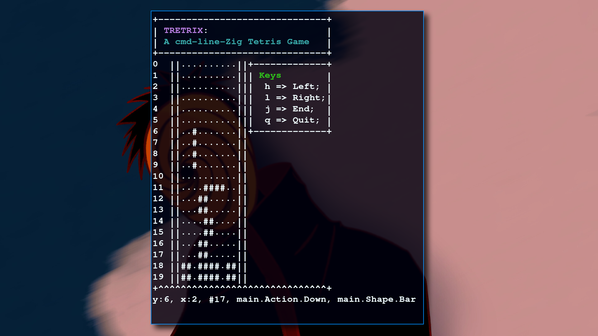

# Tretrix

### Under development 



This is a brainless command line Tetris implementation.
It's not working (properly), but one day it will!

#### Implemented shapes:
 - [X] Square;
 - [X] Bar;
 - [X] Tee;
 - [ ] Kink;
 - [ ] Elbow;

#### Do you want to pay? 
```bash 
  git clone https://github.com/luizpbraga/Tretrix
  zig run Tretrix/src/main.zig 
```
The `build.zig` is not available yet.
Zig version: `0.10.0-dev.4720+9b54c9dee`.
